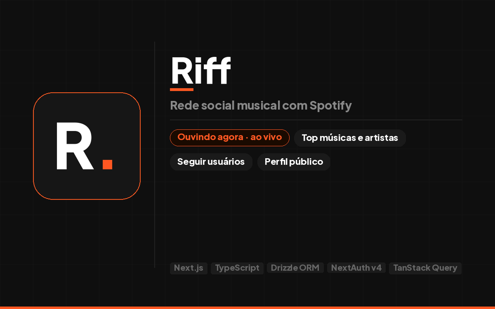

# Riff

Riff é uma rede social musical que conecta pessoas através do Spotify. Cada usuário cria um perfil com `@nome de usuário` próprio, conecta sua conta do Spotify e passa a ter uma página pública onde qualquer visitante pode ver o que ele está ouvindo agora, suas músicas e artistas mais ouvidos por período — sem esperar o Wrapped anual.

O diferencial do produto é a camada social: seguir pessoas, acompanhar o que amigos estão ouvindo em tempo real e descobrir músicas novas pelo gosto de quem você já conhece.

<p align="center">
  
</p>

## Índice

- [Visão geral](#visão-geral)
- [Funcionalidades](#funcionalidades)
- [Personas](#personas)
- [Stack](#stack)
- [Arquitetura](#arquitetura)
- [Modelo de dados](#modelo-de-dados)
- [Estrutura de pastas](#estrutura-de-pastas)
- [Ouvindo agora em tempo real](#ouvindo-agora-em-tempo-real)
- [Acesso](#acesso)
- [Princípios de produto](#princípios-de-produto)
- [Limitações conhecidas](#limitações-conhecidas)

## Visão geral

O usuário entra no Riff, conecta sua conta do Spotify (ou faz login com Google e conecta o Spotify depois) e escolhe um `@nome de usuário` único. A partir daí ele tem uma página pública, acessível por qualquer pessoa mesmo sem conta, que mostra:

- O que ele está ouvindo agora, atualizado ao vivo.
- Suas músicas e artistas mais ouvidos, filtráveis por período (último mês, últimos 6 meses, todo o tempo).
- Sua rede: quem ele segue e quem o segue.

O escopo do produto é **multi-user, single-tenant**: não existem organizações nem workspaces, cada usuário é sua própria identidade dentro da plataforma.

## Funcionalidades

### Módulos principais

- **Autenticação e onboarding** — login com Spotify ou Google, conexão da conta do Spotify e escolha do `@nome de usuário` com verificação de disponibilidade em tempo real.
- **Perfil público (`/[username]`)** — página acessível sem login, com foto de perfil, capa, bio e as demais seções abaixo.
- **Ouvindo agora** — música tocando no momento, atualizada por polling a cada 30 segundos e propagada aos visitantes via Supabase Realtime. Quando o usuário não está ouvindo nada, mostra a última música ouvida ou o estado de sem atividade recente.
- **Métricas musicais** — suas músicas mais ouvidas e seus artistas favoritos, com seletor de período (último mês, últimos 6 meses, todo o tempo).
- **Social** — seguir e deixar de seguir outros usuários, com contagem de seguidores e seguindo sempre consistente.

### Módulos transversais

- **Upload de imagem** — foto de perfil e capa via Supabase Storage.
- **Refresh automático de token do Spotify** — o token de acesso é renovado automaticamente antes de expirar, sem exigir nova autenticação do usuário.

## Personas

| Persona | Descrição |
| --- | --- |
| Ouvinte casual | Usa o Spotify no dia a dia e quer ver suas próprias estatísticas de forma visual e acessível. Acessa principalmente pelo celular. |
| Fã de música | Quer compartilhar o que está ouvindo e descobrir músicas pelo gosto de amigos. Usa web e mobile. |
| Usuário social ativo | Acessa com frequência para ver o que as pessoas que segue estão ouvindo agora. Consome o "ouvindo agora" como um feed e exige que o tempo real funcione de forma confiável. |
| Recrutador / visitante | Acessa o perfil de alguém sem ter conta própria. Avalia o produto pela qualidade visual e pela experiência de visitante anônimo. |
| Desenvolvedor / admin | O criador da plataforma. Gerencia usuários, monitora erros e cuida da saúde da aplicação. |

## Stack

| Categoria | Tecnologia |
| --- | --- |
| Framework | Next.js 16+ (App Router) |
| UI | React 19, Tailwind CSS, shadcn/ui, recharts |
| Linguagem | TypeScript |
| Server Actions | Next Safe Action |
| Formulários | React Hook Form + Zod |
| Data e hora | dayjs |
| Notificações | react-hot-toast |
| Ícones | @tabler/icons-react |
| Data fetching | TanStack Query |
| ORM | Drizzle ORM |
| Banco de dados | PostgreSQL via Supabase |
| Armazenamento de arquivos | Supabase Storage |
| Tempo real | Supabase Realtime |
| Autenticação | NextAuth v4 (Spotify OAuth e Google OAuth) |
| Deploy | Vercel |

O aplicativo mobile nativo é um projeto separado, planejado para depois do MVP. Toda a interface web é construída mobile-first, já que o perfil público é a tela mais acessada por visitantes a partir do celular.

## Arquitetura

O projeto segue quatro padrões arquiteturais, cada um mapeado a um módulo do produto:

- **Ciclo de vida com rascunho** — usado no onboarding. O perfil é salvo automaticamente a cada alteração, sem botão de salvar durante a edição; a única decisão consciente do usuário é confirmar ou descartar.
- **Operações com cascata** — usado em seguir/deixar de seguir. Seguir alguém atualiza a contagem de seguidores do usuário seguido e a contagem de seguindo do usuário atual na mesma transação; qualquer falha reverte a operação inteira.
- **Estado calculado em runtime** — usado no "ouvindo agora". O estado não é um campo fixo no banco: é recalculado a cada polling de 30 segundos contra a API do Spotify e propagado aos visitantes via Supabase Realtime.
- **Telas analíticas** — usado nas métricas musicais. São telas somente leitura, com dados buscados sob demanda na API do Spotify e período controlado por parâmetros na URL.

## Modelo de dados

O banco é modelado com Drizzle ORM sobre PostgreSQL. As tabelas principais são:

- **users** — dados de perfil (`username`, `name`, `bio`, `avatarUrl`, `bannerUrl`), credenciais de autenticação (Spotify e Google) e contadores de seguidores/seguindo.
- **follows** — relação de quem segue quem, com chave primária composta (`followerId`, `followingId`).
- **now_playing** — a música atual de cada usuário, atualizada pelo polling do Spotify.

Toda tabela de domínio segue o padrão de soft delete e auditoria: nada é apagado fisicamente do banco, registros são marcados com `deletedAt` e toda consulta de listagem filtra por `deletedAt` nulo. Tokens de acesso e de atualização do Spotify ficam no banco, mas nunca são retornados ao cliente — são usados exclusivamente em Server Actions e API Routes no servidor.

## Estrutura de pastas

```
app/
├── (auth)/
│   └── login/                    página de login
├── (app)/
│   ├── onboarding/                escolha do @nome de usuário
│   ├── configuracoes/             edição de bio, foto e capa
│   └── [username]/                perfil público
├── actions/
│   ├── perfil/                    salvar perfil, upload de foto
│   └── social/                    seguir, deixar de seguir
└── api/
    ├── auth/[...nextauth]/        configuração do NextAuth
    ├── now-playing/[username]/    polling do Spotify e escrita no banco
    └── spotify/
        ├── top-tracks/            músicas mais ouvidas
        └── top-artists/           artistas favoritos

components/
├── ui/                            componentes base do shadcn/ui
└── dominio/                       componentes de domínio do Riff

db/
├── index.ts                       inicialização do Drizzle
└── schema.ts                      esquema de tabelas e relações

hooks/
├── queries/                       hooks de leitura (TanStack Query)
└── mutations/                     hooks de escrita (TanStack Query)

lib/
├── auth.ts                        configuração do NextAuth
├── spotify.ts                     wrapper da API do Spotify e refresh de token
├── supabase.ts                    cliente Supabase
└── format/                        formatação de dados (datas, duração)
```

## Ouvindo agora em tempo real

O fluxo de "ouvindo agora" funciona assim:

1. Um visitante abre a página `/[username]` de alguém.
2. O cliente chama a rota `GET /api/now-playing/[username]`.
3. A rota busca o token de acesso do usuário no banco, renovando-o antes se estiver expirado, e consulta a música atual na API do Spotify.
4. O resultado é gravado na tabela `now_playing`.
5. O Supabase Realtime propaga a mudança para o canal do usuário.
6. A interface do visitante é atualizada automaticamente, sem recarregar a página.
7. O polling se repete a cada 30 segundos enquanto a página estiver aberta.

O estado exibido na interface depende dos dados retornados:

| Estado | Condição | O que aparece |
| --- | --- | --- |
| Ouvindo agora | música tocando no momento | nome da música, artista e capa do álbum |
| Pausado | não está tocando, mas há uma última música registrada | "última música ouvida" com o momento em que parou |
| Sem atividade recente | não está tocando e não há música recente registrada | mensagem de que o usuário está offline |

## Acesso

O Riff está no ar em [riff-mauve.vercel.app](https://riff-mauve.vercel.app/).

A API do Spotify roda em modo de desenvolvimento, que aceita no máximo 25 usuários (veja [Limitações conhecidas](#limitações-conhecidas)). Por isso, para usar todas as funcionalidades — conectar sua conta do Spotify, ver o "ouvindo agora" e suas métricas musicais — é necessário que o dono do projeto adicione seu e-mail nas cotas de desenvolvedor do Spotify.

Para ter uma visão inicial do produto sem essa liberação, basta fazer login com Google.


## Princípios de produto

- **Linguagem do domínio, não do software** — a interface fala a língua que o usuário fala no dia a dia. Termos como "entidade", "registro" ou "submeter" nunca aparecem na tela.
- **Mobile-first real** — a tela primária é o celular, no contexto real de uso. A versão web é uma adaptação para o escritório.
- **Defaults inteligentes e auto-save** — durante a construção de um rascunho, como no onboarding, o usuário não precisa clicar em salvar a cada alteração.
- **Filtragem proativa** — a interface mostra apenas o que é elegível para a ação, em vez de mostrar tudo e alertar depois.
- **Validação no servidor** — toda regra de negócio é revalidada no backend, independentemente do que o cliente faça.
- **Estado refletido na URL** — filtros, seleção e etapas de fluxo ficam em parâmetros da URL, então atualizar a página nunca perde o contexto.
- **Soft delete e auditoria por padrão** — nada é apagado de verdade, e eventos importantes ficam registrados.

## Limitações conhecidas

- O modo de desenvolvimento da API do Spotify aceita até 5 usuários, cada um liberado manualmente pelo dono do app. **Este é um teto fixo para o projeto, não uma etapa pendente.** Desde 15 de maio de 2025, a extensão de quota do Spotify só é concedida a organizações que comprovem entidade jurídica registrada, serviço lançado, presença nos mercados principais, viabilidade comercial e um mínimo de 250 mil usuários ativos por mês — critérios que um projeto pessoal não tem como atingir, já que crescer até lá exigiria justamente a quota estendida. Ver [Quota modes](https://developer.spotify.com/documentation/web-api/concepts/quota-modes).
- As métricas musicais são buscadas sob demanda na API do Spotify, sem cache pesado no MVP.
- O histórico de músicas é limitado às últimas 50 reproduções retornadas pela API do Spotify; um histórico mais longo, no estilo Wrapped, exigiria um processo periódico de persistência ainda não implementado.
- O aplicativo mobile nativo não está incluído neste projeto.
